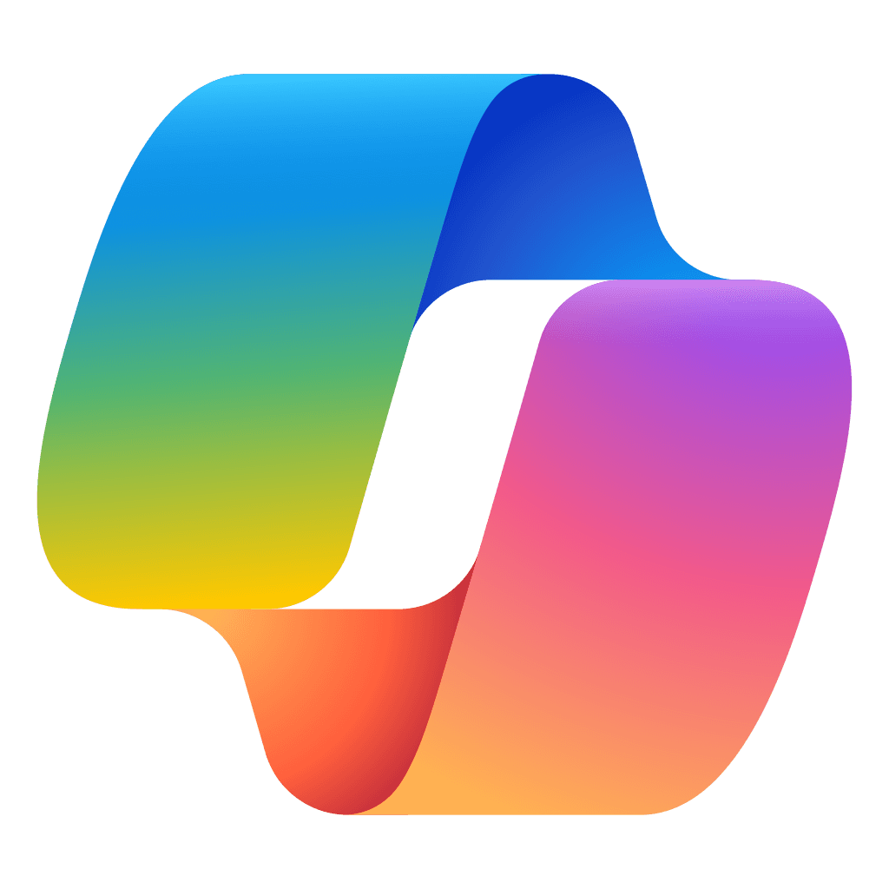

# GITHUB
**GitHub** es una plataforma donde puedes guardar, organizar y compartir código y proyectos, GITHUB pertenece a *Microsoft* la cual la compro en 2018 por 7.500 millones de dólares.

# COPILOT 
Es un **asistente de inteligencia artifical** creado por Microsoft fue publicado originalmente como:
- Bing chat
  - Lanzado en 2023
- Copilot
  - el 15 de noviembre de 2023 fue renombrado a *Copilot* 
